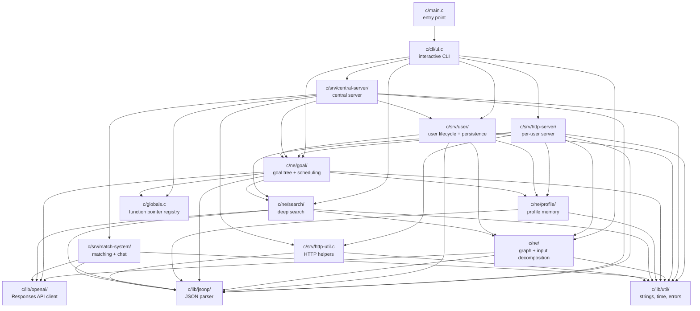

# CHANGE Technical Documentation

This document describes the current C backend as implemented under `c/`.
It is written from the code, not from the intended product story, so it includes
the actual runtime boundaries, persistence model, and known rough edges.

## System Overview

The application is a local, single-user-at-a-time CLI that can start two HTTP
servers:

- a per-user client server that exposes graph, goal, profile, middleware, and
  debug routes
- a central server that manages users, shared journeys, and the connection
  matching system

The entry point is `c/main.c`, which delegates immediately to the CLI in
`c/cli/ui.c`. The CLI is the operator shell for starting servers, pushing text
into the graph, running deep search, creating goals, exporting state, and
regenerating mock data.

## Architecture Diagram

```mermaid
flowchart LR
    subgraph ROOT["Repository Root"]
        MAINFILE["c/main.c<br/>CLI entry"]
        DOCS["docs.md<br/>technical docs"]
        README["README.md<br/>project overview"]
    end

    subgraph CLI_DIR["c/cli"]
        UI["ui.c / ui.h<br/>interactive operator shell"]
    end

    subgraph CORE_DIR["c/ne"]
        NODE["node.c / node.h<br/>graph primitives"]
        GRAPH_ENGINE["graph/graph-engine.c<br/>activation + weight refresh"]
        GRAPH_EXPORT["graph/graph-export.c<br/>graph JSON export"]
        INPUT["input/input-processor.c<br/>text -> graph decomposition"]
        JSON_TO_GRAPH["input/json-to-graph.c<br/>graph ingestion"]
        SEARCH_DIR["search/*.c<br/>deep search + node family filters"]
        GOAL_DIR["goal/*.c<br/>goal trees, AI decomposition, schedule"]
        PROFILE_DIR["profile/user-profile.c<br/>profile history + derived state"]
    end

    subgraph SRV_DIR["c/srv"]
        HTTP_UTIL["http-util.c<br/>HTTP parsing, JSON helpers, sockets"]
        USER_HTTP["http-server/*.c<br/>per-user HTTP server + SSE"]
        CENTRAL_HTTP["central-server/*.c<br/>central server and shared journeys"]
        MATCH_DIR["match-system/*.c<br/>connection matching + chat"]
        USER_DIR["user/*.c<br/>user lifecycle, journeys, on-disk storage"]
    end

    subgraph LIB_DIR["c/lib"]
        JSONP["jsonp/json.c<br/>JSON parser"]
        OPENAI["openai/openai.c<br/>Responses API client"]
        MOCKOPENAI["openai/mockopenai.c<br/>fixture generator"]
        UTIL_LIB["util/util.c<br/>strings, files, helpers"]
        TIME_UTIL["util/time-util.c<br/>time offset helpers"]
        HASHDICT["hd/hashdict.c<br/>small dictionary"]
    end

    subgraph API_USER["Per-user server endpoints"]
        U1["GET /graph<br/>serialize current graph"]
        U2["POST /graph/export<br/>write graph-copy.json"]
        U3["GET /graph/load<br/>reload graph-copy.json"]
        U4["POST /message<br/>ingest text into graph"]
        U5["POST /research/start<br/>start deep search"]
        U6["GET /research/events<br/>SSE stream"]
        U7["POST /middleware/message<br/>LLM orchestration"]
        U8["POST /middleware/permission<br/>approve pending write"]
        U9["GET /middleware/events<br/>SSE stream"]
        U10["GET /middleware/session<br/>session snapshot"]
        U11["GET /chat/sessions<br/>session list"]
        U12["GET /profile<br/>profile summary"]
        U13["POST /profile/update<br/>edit profile fields"]
        U14["GET /schedule<br/>derived schedule report"]
        U15["Goal routes<br/>create/start/end/drop/repair/list/export"]
        U16["Dev routes<br/>time advance/reset"]
    end

    subgraph API_CENTRAL["Central server endpoints"]
        C1["GET /users<br/>list users"]
        C2["POST /users/create<br/>create user"]
        C3["POST /users/select<br/>select user + start client server"]
        C4["POST /journey/create<br/>create shared journey"]
        C5["GET /journey/:id<br/>fetch shared journey"]
        C6["POST /journey/:id<br/>update shared journey"]
        C7["POST /connections/discoverable<br/>opt in to matching"]
        C8["POST /connections/private<br/>opt out of matching"]
        C9["POST /connections/description<br/>update match description"]
        C10["GET /connections?user_id=...<br/>list connections"]
        C11["POST /connections/approve<br/>approve proposal"]
        C12["POST /connections/decline<br/>decline proposal"]
        C13["POST /messages/send<br/>send connection message"]
        C14["GET /messages?connection_id=...<br/>list messages"]
    end

    MAINFILE --> CLI_DIR
    MAINFILE --> SRV_DIR
    MAINFILE --> CORE_DIR

    UI --> USER_DIR
    UI --> USER_HTTP
    UI --> CENTRAL_HTTP
    UI --> GRAPH_ENGINE
    UI --> INPUT
    UI --> SEARCH_DIR
    UI --> GOAL_DIR
    UI --> OPENAI

    USER_HTTP --> U1
    USER_HTTP --> U2
    USER_HTTP --> U3
    USER_HTTP --> U4
    USER_HTTP --> U5
    USER_HTTP --> U6
    USER_HTTP --> U7
    USER_HTTP --> U8
    USER_HTTP --> U9
    USER_HTTP --> U10
    USER_HTTP --> U11
    USER_HTTP --> U12
    USER_HTTP --> U13
    USER_HTTP --> U14
    USER_HTTP --> U15
    USER_HTTP --> U16

    CENTRAL_HTTP --> C1
    CENTRAL_HTTP --> C2
    CENTRAL_HTTP --> C3
    CENTRAL_HTTP --> C4
    CENTRAL_HTTP --> C5
    CENTRAL_HTTP --> C6
    CENTRAL_HTTP --> C7
    CENTRAL_HTTP --> C8
    CENTRAL_HTTP --> C9
    CENTRAL_HTTP --> C10
    CENTRAL_HTTP --> C11
    CENTRAL_HTTP --> C12
    CENTRAL_HTTP --> C13
    CENTRAL_HTTP --> C14

    USER_DIR --> USER_HTTP
    USER_DIR --> GRAPH_EXPORT
    USER_DIR --> JSON_TO_GRAPH
    USER_DIR --> GOAL_DIR
    USER_DIR --> PROFILE_DIR
    USER_DIR --> JSONP
    USER_DIR --> UTIL_LIB

    MATCH_DIR --> OPENAI
    MATCH_DIR --> JSONP
    MATCH_DIR --> UTIL_LIB

    GRAPH_ENGINE --> JSONP
    GRAPH_ENGINE --> UTIL_LIB
    INPUT --> OPENAI
    INPUT --> JSONP
    INPUT --> PROFILE_DIR
    SEARCH_DIR --> OPENAI
    SEARCH_DIR --> GRAPH
    SEARCH_DIR --> JSONP
    GOAL_DIR --> OPENAI
    GOAL_DIR --> SEARCH_DIR
    GOAL_DIR --> PROFILE_DIR
    PROFILE_DIR --> JSONP
    PROFILE_DIR --> UTIL_LIB

    HTTP_UTIL --> JSONP
    HTTP_UTIL --> UTIL_LIB
    CENTRAL_HTTP --> MATCH_DIR
    CENTRAL_HTTP --> USER_DIR
    CENTRAL_HTTP --> GOAL_DIR
    CENTRAL_HTTP --> JSONP
    CENTRAL_HTTP --> UTIL_LIB

    JSONP --> UTIL_LIB
    OPENAI --> UTIL_LIB
    MOCKOPENAI --> OPENAI
    TIME_UTIL --> UTIL_LIB
    HASHDICT --> UTIL_LIB
```

## Boot Sequence

Startup is layered and stateful:

1. `main()` calls `UIStart()`, `UILoop()`, and `UIKill()`.
2. `UIStart()` initializes users, creates the five context root nodes, registers
   global function pointers, and initializes the goal system.
3. `InitUserSystem()` scans `user-data/`, loads user meta files, graphs, and
   journeys, and creates a default user if none exist.
4. `InitJourneySystem()` and `SetupContextNodes()` prepare the in-memory graph
   roots used by the neuroengine.
5. `InitGlobalPointerMap()` registers cross-module callbacks such as
   `ds_emit_event` and `goal_emit_event`.

The central server and the per-user server both run on top of the same
in-memory user and journey tables. The central server also initializes the
connection system and shared journey store.

## Core Data Model

### String

The project uses a custom `String` type from `c/lib/util/util.h`:

- `p` is heap storage
- `len` is the used byte count
- `cap` is the allocated capacity
- `used` and `init` are lifecycle flags

All string concatenation, resizing, escaping, and copying is done through this
utility layer. The code assumes these strings are mutable and often writes into
them directly.

### Graph Nodes

The neuroengine graph lives in `c/ne/node.h` and `c/ne/node.c`.

- `Node` stores a label, activation, weight, parent pointer, children index,
  and a dynamic neighbor array
- `Connection` stores activation, weight, last touch time, pending touches, and
  the target node index
- `NodeContainer` owns the flat node array and tracks counts, capacities,
  connection totals, and the five context root indices

The five built-in contexts are:

- `profesie`
- `emotie`
- `pasiuni`
- `generalitati`
- `subiectiv`

Each context is a root node. All user identity content is inserted beneath one
of these roots.

### Users

`User` in `c/srv/user/user-management.h` is the main tenant object.

- `id` is the stable storage key and directory name
- `name` is the display name
- `port` is the per-user server port
- `journeys[]` stores journey IDs
- `nodes` is the user identity graph
- `schedule_table` caches derived schedule entries
- `discoverable` and `description` are the connection-matching fields

The user table is a fixed-size global array with `MAX_USERS = 8`.

### Journeys

`Journey` in `c/srv/user/journey.h` is a named ordered collection of root
goals.

- `id` is a random ID
- `title` and `extra_info` are stored as strings
- `goals[]` holds pointers to all goals in the journey
- `is_shared` marks shared journeys

The first journey is created automatically for every new user and is the
default destination for goal creation.

### Goals

`Goal` in `c/ne/goal/goal-util.h` is a tree node with scheduling state.

- `title` and `extra_info` define the task
- `start_date` and `end_date` track progress
- `required_time` is the estimated elapsed time, not focused time
- `subgoals[]` stores ordered child indices
- `parent`, `prev`, and `next` encode the tree and sibling sequence
- `minPauseToNext` and `pauseToNext` drive schedule spacing
- `priority` is meaningful on root goals and affects scheduling order
- `journey_id` ties the goal to its journey

Goals are always stored inside a journey and referenced by local indices. The
tree is sequential, not arbitrary: children represent ordered steps.

### Schedules and Profile Memory

The schedule system stores derived timeline entries in `struct ScheduleEntry`
with:

- `time`
- `goalIndex`
- `journey_id`

The profile system stores history and derived operational memory in the
`user-profile.log` file. It is not a generic database; it is a structured text
file with three sections:

- input history
- goal activity history
- derived summary

## Persistence Layout

All persistent state lives under `user-data/` using the user ID as the storage
directory.

For each user:

- `.meta` stores user name, port, discoverability, description, and journey IDs
- `graph-copy.json` stores the serialized graph
- `goals-copy.json` stores the journey tree data
- `user-profile.log` stores the profile memory sections
- `journey-<id>.json` stores each journey

The connection system stores its own data under:

- `user-data/connections/<connection-id>.conn`
- `user-data/connections/<connection-id>.msgs`

Shared journeys are stored under:

- `shared-journeys/<journey-id>.json`

The persistence model is simple: most mutations call `SaveUser()` or a module
specific persist function immediately after state changes.

## Graph Engine

The graph engine in `c/ne/graph/graph-engine.c` is the user identity memory
mechanism.

### Node and Connection Dynamics

Every node and connection has:

- activation
- weight
- last touched time
- pending touch count

Touching a node or connection increments pending touches. `RefreshGraph()` then
applies:

- exponential decay over time
- a logarithmic boost from pending touches
- a weight recomputation based on support, seen counts, used counts, and the
  decay/merit constants in `c/config.h`

The implementation uses the constants defined in `config.h`:

- `ACTIVATION_IMPORTANCE_TO_NODE_WEIGHT`
- `NCOUNT_PENALTY_TO_NODE_WEIGHT`
- `SUPPORT_MERIT_TO_NODE_WEIGHT`
- `NODE_OLD_WEIGHT_RELEVANCE`
- `ACT_HALFTIME`

This means graph importance is not static. It is re-normalized whenever the
graph is refreshed, especially during deep search.

### Context Roots

`SetupContextNodes()` creates the five root nodes once per user graph. All
contextual nodes are attached beneath one of these roots. A lookup for a node
within a context starts from the context root, which is why context scoping is
important throughout the loader and exporter.

### Export and Import

`c/ne/graph/graph-export.c` serializes the graph into a flat JSON structure:

- `nodes[]` contains node labels, ids, activation, weight, and parent
- `connections[]` contains source/target node IDs and edge metrics

`c/ne/input/json-to-graph.c` performs the inverse operation when loading a graph
or ingesting new AI-generated graph content.

## Input Decomposition Pipeline

User text is transformed into graph updates by `DecomposeInputIntoGraph()` in
`c/ne/input/input-processor.c`.

The flow is:

1. Record the input in the user profile history.
2. Build a prompt that instructs OpenAI to return a structured JSON object for
   the five contexts.
3. Send the prompt to the OpenAI Responses API using `gpt-5.4-mini`.
4. Parse the returned JSON content from the model response envelope.
5. Feed each context object into `AddContextNodesFromJSON()`.

The JSON schema expects, for each context:

- a `nodes` array of `{name, weight, activation}`
- a `connections` array of `{nodes, weight, activation}`

When a node already exists in that context, the loader touches it rather than
duplicating it. When a connection already exists, it touches the connection
instead of creating a duplicate edge.

The loader intentionally biases new node and connection weights toward the
existing defaults using the `NODE_GUESS_WEIGHT_RELEVANCE` and
`CONNECTION_GUESS_WEIGHT_RELEVANCE` constants.

## Goal System

The goal system is spread across `c/ne/goal/goal.c`, `goal-util.c`,
`goal-info.c`, `goal-ai.c`, `goal-health.c`, and `schedule-system.c`.

### Creation

`CreateUserGoal()` is the main entry point for goal creation.

- the middleware or HTTP layer supplies `goal_input1` and `goal_input2`
- the goal is personalized using deep search
- the resulting root goal is added to a journey
- the system then attempts partial decomposition into child goals

The design is intentionally AI-driven: `goal_input1` is the concise goal title
and `goal_input2` is the rich practical context used to estimate required time
and shape decomposition.

### Decomposition

`DecomposeGoal()` and `ComputePartialDecomposition()` recursively break a goal
into sequential child goals until leaf tasks are small enough to execute.

The decomposition is not just splitting text. It uses AI-generated structure to
determine:

- child titles
- child ordering
- child timing
- supporting extra info

`RepairGoalBranch()` can rebuild a branch when the user context has changed.
The repair code attempts to preserve valid progress state by matching old and
new branches structurally.

### Progress and Lifecycle

The status actions in the HTTP layer call:

- `StartGoalDeepFromGoal()`
- `EndGoalFromGoal()`
- `DropGoalTree()`
- `RepairGoalBranch()`

Goals are considered active when `start_date` is set and `end_date` is not.
Completion propagates upward when all children are finished.

### Serialization

`SerializeGoal()` and the related helpers in `goal-info.c` are used to build the
descriptive payloads shown to the middleware and to the HTTP API.

These serializers can emit:

- parent chains
- sibling chains
- follow-up chains
- stalled goals
- due goals
- leaf due goals
- completed user goal history

The middleware uses these serialized views to provide the language model with a
compact but rich snapshot of the user's current situation.

## Goal Health and Schedule Derivation

`RunGoalHealthCheck()` in `c/ne/goal/goal-health.c` recalculates the user's
workload schedule whenever goal state changes.

It reads work block preferences from the user profile:

- `work_day_start`
- `daily_work_hours`

Then it:

- scans all journeys
- finds due leaf goals
- orders them by root priority and age
- packs them into work blocks
- adjusts `pauseToNext` on predecessor goals when needed

The schedule is stored in memory on the user object and regenerated when marked
dirty. `SerializeScheduleData()` turns the schedule into a human-readable report
for the middleware and for the `/schedule` endpoint.

## User Profile Memory

`c/ne/profile/user-profile.c` maintains a structured log file rather than a
database table.

The file is divided into sections:

- input history
- goal activity
- derived profile

The derived section is especially important because it stores operational state
used by other systems:

- latest input source
- latest input text
- last goal event
- last goal id
- last goal title
- current focus goal id
- current focus goal title

The middleware reads these summaries when constructing prompts. The profile
module also preserves non-fixed custom fields so auxiliary systems can add their
own derived keys without being erased.

## Middleware Layer

The middleware in `c/middleware/middleware.c` is the AI orchestrator that sits
above the graph and goal systems.

### Responsibilities

The middleware is responsible for:

- interpreting user chat input
- deciding whether to update profile memory
- deciding whether to create goals
- deciding whether to call deep search
- deciding whether to update the graph
- deciding whether to trigger matching-related actions
- asking for permission when the model wants to store sensitive profile data

### Prompt Context

The middleware prompt is assembled from:

- raw user input
- per-session chat history
- user profile summary
- input history
- goal activity history
- active goals
- schedule snapshot
- completed goals
- stalled goals
- retry feedback
- deep-search feedback

This means the middleware model does not operate on a bare prompt. It sees a
compressed operational memory of the user.

### Action Model

The middleware output schema contains:

- `assistant_message`
- `actions[]`
- `suggested_replies[]`

The action executor supports:

- `reply`
- `set_profile`
- `clear_profile`
- `ask_permission`
- `create_goal`
- `set_goal_priority`
- `call_deep_search`
- `update_graph`
- `delay_goal`
- `drop_goal`
- `repair_branch`
- `set_discoverable`
- `set_private`
- `update_match_description`
- `find_match`

Important implementation detail:

- `set_profile` can be silent or permission-gated depending on the key
- `ask_permission` always pauses execution and creates a pending permission
- `call_deep_search` short-circuits the turn and re-invokes the session after
  the search completes
- `create_goal`, `drop_goal`, and `repair_branch` require explicit user
  confirmation in the current turn

### Session History

The middleware keeps a per-session history buffer in memory. It also records
events into a compact JSON array so the UI can replay the session state.

## Deep Search

Deep search lives in `c/ne/search/deep-search-session.c`.

It is a looped reasoning process that:

- constructs a persistent prompt describing the investigation task
- refreshes the user graph first
- calls OpenAI for one action at a time
- executes the action
- judges the result
- retries with feedback if the output fails validation

The deep search prompt is built around the graph and goal system as evidence
sources. The agent is instructed to investigate rather than directly solve the
task. The judge enforces that the search does not terminate before the minimum
round count.

The search engine also uses `c/ne/search/search.c` to:

- filter nodes or connections by activation or weight
- recursively compute a node family / neighborhood view
- produce graph-focused text summaries for the AI

## HTTP Architecture

There are two HTTP servers:

### Per-user server

Implemented in `c/srv/http-server/`.

It listens on a user-specific port and serves:

- `GET /graph`
- `POST /graph/export`
- `GET /graph/load`
- `POST /message`
- `POST /research/start`
- `GET /research/events`
- `POST /middleware/message`
- `POST /middleware/permission`
- `GET /middleware/events`
- `GET /middleware/session`
- `GET /chat/sessions`
- goal routes
- profile routes
- dev/time routes
- `GET /schedule`

This server also hosts SSE streams for live goal, research, and middleware
events.

### Central server

Implemented in `c/srv/central-server/`.

It manages:

- user listing and creation
- user selection
- shared journey storage
- connection opt-in and matching
- connection approval/decline
- connection chat

The central server and user server both use the common HTTP parsing utilities in
`c/srv/http-util.c`.

### SSE

`c/srv/http-server/sse.c` implements a shared SSE client pool.

- clients are tracked by stream ID
- dead clients are pruned by ping writes
- events are emitted as JSON payloads
- `ds_emit_event()` and `goal_emit_event()` are thin wrappers around the same
  emitter

This is why `SIGPIPE` is ignored on server startup.

## User and Central Server Startup

`InitUserSystem()` loads all users from disk, initializes journeys, and creates
a default user if none exist.

`start_central_server()` additionally:

- initializes the global pointer map
- registers `ds_emit_event` and `goal_emit_event`
- starts the goal and connection systems
- loads shared journeys
- starts a per-user server for the first loaded user if one exists

The central server uses the same in-memory user objects as the per-user server.
This is a local monolith with two sockets, not two independent applications.

## Connection Matching System

The matching system lives in `c/srv/match-system/` and is intentionally
separate from the graph and goal systems.

### Data

`UserConn` stores:

- connection ID
- user A and user B IDs
- approval flags
- state
- proposal timestamp
- match reason

`UserConnMessage` stores:

- connection ID
- sender ID
- timestamp
- message text

### Persistence

Connections are persisted as single-line JSON in `.conn` files.
Messages are appended line-by-line in `.msgs` files.

On startup, the connection system:

- creates `user-data/connections/` if missing
- loads all connection files into memory
- loads the message logs for each connection

### Matching Flow

`FindMatchForUser()` is the main matching pass for one user.

1. Ignore users that are not discoverable or do not have a description.
2. Skip any pair that already has a connection record.
3. Build the candidate list from other discoverable users.
4. Ask OpenAI to identify plausible matches and reasons.
5. Run a second AI pass to rank the shortlist when necessary.
6. Create a proposed connection with `state = CONN_PROPOSED`.
7. Persist the connection immediately.

The model never sees raw server internals. It sees user descriptions and a
formatted candidate list. The output is a schema-limited JSON object.

### Connection States

- `CONN_PROPOSED` means one user proposed a connection and approval is pending
- `CONN_CONFIRMED` means both sides approved
- `CONN_DECLINED` means at least one side declined

Users only see the other party's display name and the reason string. The raw
description is private.

### Matching API

The central server exposes:

- `POST /connections/discoverable`
- `POST /connections/private`
- `POST /connections/description`
- `GET /connections?user_id=...`
- `POST /connections/approve`
- `POST /connections/decline`
- `POST /messages/send`
- `GET /messages?connection_id=...`

## OpenAI Integration

The project uses the OpenAI Responses API through `c/lib/openai/openai.c`.

Important traits:

- requests are sent directly over TLS using OpenSSL
- the API key is read from `OPENAI_API_KEY`
- HTTP responses are buffered and parsed manually
- non-2xx responses are captured for debugging
- retries are attempted on transport failures

The code currently uses:

- `gpt-5.4-mini` for graph decomposition and many orchestration tasks
- `gpt-5.5` for the final connection-ranking pass

Mock generation in `c/lib/openai/mockopenai.c` also uses the Responses API to
generate synthetic graph and action fixtures.

## Time System

`c/lib/util/time-util.c` provides a simple global time offset.

- `change_time_now()` returns `time(NULL) + offset`
- `change_time_advance_seconds()` moves the offset forward
- `change_time_reset()` clears the offset
- `format_time_human()` converts timestamps into user-friendly labels

This is used heavily by the dev/time routes and by goal/schedule logic.

## Global Pointer Registry

`c/globals.c` implements a small pointer registry around the hash dictionary in
`c/lib/hd/`.

It is used to expose function pointers across modules without creating hard
link-time cycles. The main registered functions are:

- `ds_emit`
- `goal_emit`
- journey title lookup
- journey info lookup

This registry is a convenience layer, not a general service locator.

## Operational Notes

- The project assumes a Unix-like environment.
- The build and runtime configuration in `c/config.h` is currently tied to a
  fixed `PROJECT_ROOT`.
- The graph and goal systems are strongly coupled to the exact file formats
  they write.
- Several modules contain AI-generated code and commented TODOs that should be
  treated as implementation notes, not design guarantees.

## Known Rough Edges

- Some documentation in `docs/` is older than the current code paths.
- The system relies on immediate persistence after mutations, which keeps the
  code simple but can be chatty on disk.
- The matching system is intentionally conservative about data exposure, but
  the privacy guarantees are still only as strong as the description the user
  provides.
- Several subsystems assume fixed-size arrays and small user counts; scaling
  would require structural changes rather than parameter tuning.

## File Map

- `c/main.c` - process entry point
- `c/cli/ui.c` - interactive CLI and server launcher
- `c/srv/http-server/` - per-user HTTP server and SSE
- `c/srv/central-server/` - central server and shared journeys
- `c/srv/match-system/` - connection matching and chat persistence
- `c/srv/user/` - user lifecycle, journeys, on-disk storage
- `c/ne/` - neuroengine graph, goals, input processing, search, profile
- `c/lib/` - JSON parser, OpenAI client, utilities, hash dictionary

If you extend the system, update this document alongside the code. The
architecture is compact enough that stale documentation becomes misleading
quickly.
